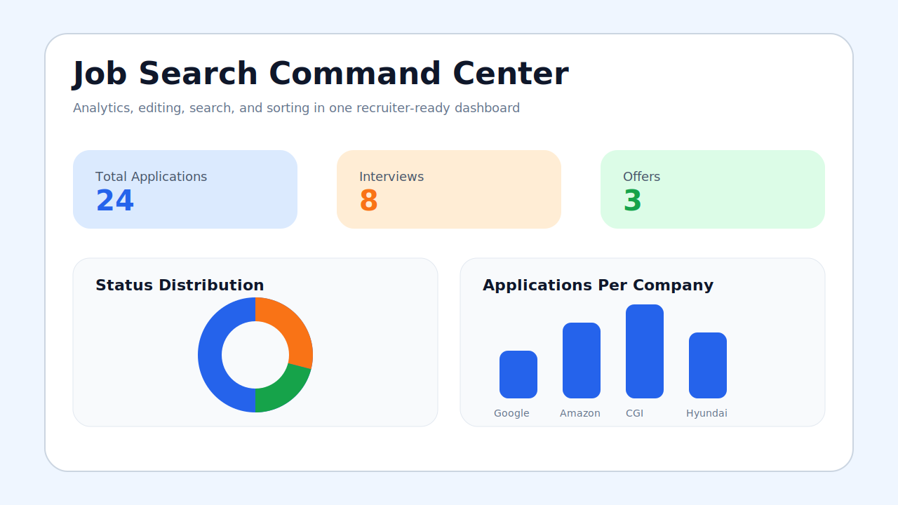
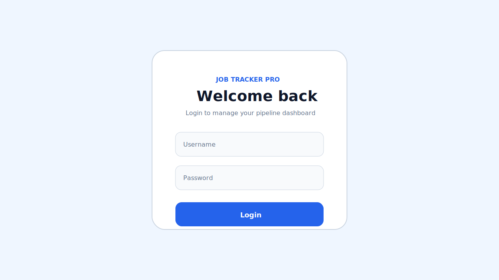

# Job Tracker Pro

A portfolio-ready job application dashboard built with React, Material UI, and Recharts. It helps you track job applications, edit each opportunity, search and sort your pipeline, and visualize interview/offer progress with charts.

## Live Demo

- Frontend: `https://your-frontend-demo-url.netlify.app`
- Backend API: `https://your-backend-service.onrender.com`

Update these links after deploying to Netlify/Vercel and Render/Railway.

## Screenshots





## Features

- JWT auth with login/register flow
- Username displayed in dashboard header
- Logout confirmation dialog
- Token expiry handling with auto logout
- Add, edit, and delete job applications
- Edit company, role, status, and notes directly on each job card
- Search jobs by company name
- Sort jobs by newest, oldest, or status
- Status filters for All, Applied, Interview, Offer, and Rejected
- Summary cards with status-based colors and soft shadows
- Pie chart for status distribution
- Bar chart for applications per company
- Deployment-ready Netlify and Vercel SPA routing config

## Tech Stack

- React
- React Router
- Material UI
- Recharts
- Fetch API
- JWT-based authentication

## Environment Variables

Create a `.env` file in the frontend root:

```env
REACT_APP_API_BASE_URL=https://your-backend-service.onrender.com
```

For local development, you can point this to your backend host:

```env
REACT_APP_API_BASE_URL=http://localhost:8000
```

If `.env` is not set, the app automatically uses the current browser host with port `8000`.

## Run Locally

```bash
npm install
npm start
```

Create a production build:

```bash
npm run build
```

## Deploy Frontend

### Netlify

1. Push this frontend folder to GitHub.
2. In Netlify, import the repo.
3. Set build command to `npm run build`.
4. Set publish directory to `build`.
5. Add `REACT_APP_API_BASE_URL` in Site Settings > Environment Variables.
6. Deploy.

`netlify.toml` is already included for SPA route fallback.

### Vercel

1. Import the frontend repo into Vercel.
2. Set framework preset to Create React App.
3. Add `REACT_APP_API_BASE_URL` in Project Settings > Environment Variables.
4. Deploy.

`vercel.json` is already included for SPA rewrites.

## Deploy Backend

Use Render or Railway for the backend API.

### Render

1. Push your backend project to GitHub.
2. Create a new Web Service in Render.
3. Set the start command for your backend server.
4. Add database and JWT environment variables.
5. Copy the deployed backend URL and place it in `REACT_APP_API_BASE_URL`.

### Railway

1. Create a new Railway project from your backend GitHub repo.
2. Add required environment variables.
3. Deploy the backend service.
4. Use the public Railway API URL in `REACT_APP_API_BASE_URL`.

## Project Structure

```text
src/
  App.js
  JobTracker.js
  Login.js
  apiConfig.js
  auth.js
  jobTrackerConfig.js
  components/
    AddJobForm.js
    DashboardHeader.js
    JobCard.js
    JobCharts.js
    JobFilters.js
    LogoutDialog.js
```

## Notes

- Sorting by date uses `created_at`, `createdAt`, `updated_at`, or `updatedAt` when those fields exist in the API response.
- If your backend does not return a date field, the UI falls back to `id` ordering.
- Saving edited company/role fields requires the backend `PUT /jobs/:id` endpoint to accept those fields. If it only updates status/notes right now, share the backend path and I can patch that too.
